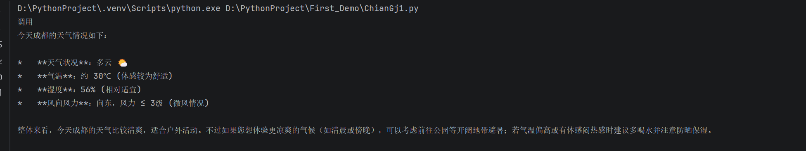

# 🌤️ AI 天气查询助手

基于 **LangChain + Ollama + 高德地图API** 的智能天气查询工具。AI 能自动理解用户意图，调用天气接口返回结果。

## ✨ 功能

- 自然语言查询天气（如："今天北京天气怎么样"）
- AI 自动判断是否调用工具
- 支持本地 Ollama 模型，无需联网
- 完善的错误处理

## 🚀 快速开始

### 1. 安装依赖
```bash
pip install -r requirements.txt
```

### 2. 配置 API 密钥
复制 `.env.example` 为 `.env`，填入高德地图 API Key：
```
GAODE_API_KEY=你的高德API密钥
```

### 3. 启动 Ollama
```bash
ollama serve
```

### 4. 运行
```bash
python ChianGj1.py
```

## 📸 运行截图



## 🛠️ 技术栈

- Python 3.9+
- LangChain / LangGraph
- Ollama (本地大模型)
- 高德地图天气 API

## 👤 作者

ZongTao Zhang
